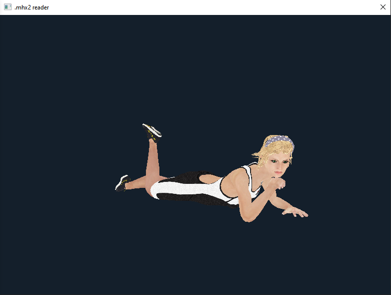

# MakeHuman

This repository contains several projects I wrote around the [MakeHuman](http://www.makehumancommunity.org/) application.

## Mhx2
This project is a small c++ reader for MakeHuman Exchange (.mhx2) files. It's currently a draft, and it needs to be terminated and optimized, but it roughly works. A basic OpenGL renderer is also provided.

The project was written and may be compiled with Visual Studio 2019.

